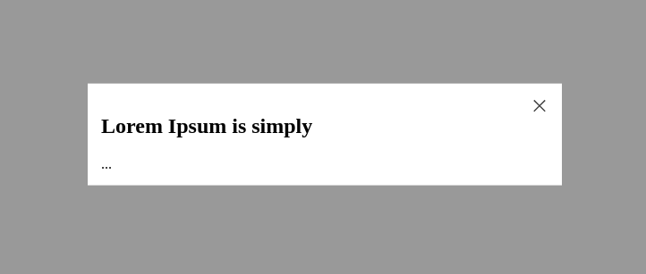

# React Modal Easy

> Simple modal with good accessibility

   

The purpose of this component is to provide a simple interface. You won't find predefined styles to cause you problems or unnecessary customizations.

## Install

```bash
npm i react-modal-easy
```

## Usage

```tsx
// include styles
import 'react-modal-easy/dist/style.css';

const [visible, setVisible] = useState(false);

return (
  <Modal isVisible={visible} onClose={() => setVisible(false)}>
    <div style={{ backgroundColor: 'white', width: 500, padding: 20 }}>
      <Modal.Title>React Modal Easy</Modal.Title>
      ...
    </div>
  </Modal>
);
```



## Acessibility

By internally using the [Radix Dialog](https://www.radix-ui.com/primitives/docs/components/dialog), this component comes with accessibility configurations by default. However, for the best use of this feature, also utilize the `Title`, `Description` and `Close` components.

```tsx
...
return (
  <Modal
    isVisible={visible}
    onClose={onClose}
    closeButton={
      <Modal.Close onClick={onClose} aria-label='Close'>
        Fechar
      </Modal.Close>
    }
  >
    <Modal.Title>Lorem Ipsum is simply</Modal.Title>
    <Modal.Description>
      Lorem Ipsum is simply dummy text of the printing and typesetting industry.
    </Modal.Description>
    ...
  </Modal>
);
```

## Props

| Property          | Type                           | Default   | Description                             |
| ----------------- | ------------------------------ | --------- | --------------------------------------- |
| isVisible         | boolean                        |           | whether to show dialog                  |
| onClose           | function                       |           | handler called onClose of modal         |
| closeButton?      | React.ReactNode                | Component | close component, use `null` to disable. |
| className?        | string                         |           | modal component class                   |
| overlayClassName? | string                         |           | overlay component class                 |
| animation?        | 'scale' , 'translate' , 'none' | scale     | animation type                          |

## Components

| Name                                                                                        | Description                                                                   |
| ------------------------------------------------------------------------------------------- | ----------------------------------------------------------------------------- |
| [Modal.Title](https://www.radix-ui.com/primitives/docs/components/dialog#title)             | An accessible title to be announced when the dialog is opened.                |
| [Modal.Description](https://www.radix-ui.com/primitives/docs/components/dialog#description) | An optional accessible description to be announced when the dialog is opened. |
| [Modal.Close](https://www.radix-ui.com/primitives/docs/components/dialog#close)             | The button that closes the dialog.                                            |
